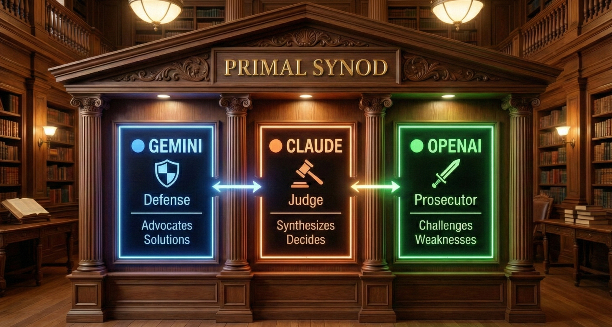
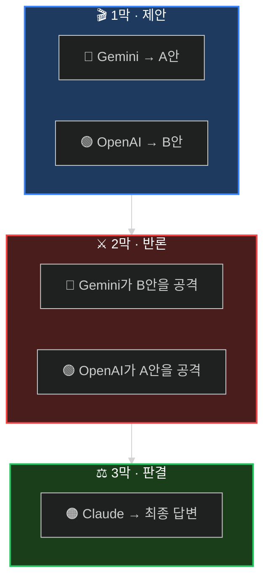

<div align="center">

<!-- Hero Banner -->


<br/>

<!-- Tagline -->
### *하나의 AI로 부족할 때, 의회를 소집하라.*

<br/>

<!-- Status Badges -->
<p>
<a href="#-60초-설정"></a>
<a href="https://arxiv.org/abs/2309.13007"></a>
<a href="LICENSE"></a>
<a href="https://github.com/quantsquirrel/claude-synod-debate"></a>
</p>

<!-- Language Toggle -->
**[English](README.md)** · **[한국어](README.ko.md)**

</div>

<br/>

<div align="center">

**😵‍💫 단일 LLM은 과신한다** &nbsp;→&nbsp; **⚔️ 서로 토론시켜라** &nbsp;→&nbsp; **✅ 더 나은 결론**

</div>

<br/>

---

<div align="center">

## 🎭 심의 3막

*모든 안건은 동일한 절차를 거칩니다*

</div>

<br/>



<div align="center">

| 막 | 과정 | 의의 |
|:---:|:----------|:------------|
| **I** | 각 모델이 독립적으로 해법을 제시 | 집단사고를 차단하고 다양성을 확보 |
| **II** | 상대방의 해법을 교차 심문 | 약점을 드러내고 편향에 도전 |
| **III** | 반론을 거쳐 최종 판결 | 검증을 통과한 답변만 살아남음 |

</div>

<br/>

---

<div align="center">

## ⚡ 60초 설정

</div>

```bash
# 1️⃣ 저장소 클론
git clone https://github.com/quantsquirrel/claude-synod-debate.git
cd claude-synod-debate

# 2️⃣ 로컬 모델 브리지 준비
export GEMINI_API_KEY="your-gemini-key"
export OPENAI_API_KEY="your-openai-key"

# 3️⃣ 초기 설정 (의존성 설치, CLI 구성, 모델 테스트)
/synod-setup

# 4️⃣ 의회 소집
/synod review 이 인증 플로우가 안전한가요?
```

<div align="center">

**이것으로 끝입니다.** 의회가 자동으로 소집됩니다.

<br/>


</div>

<br/>

---

<div align="center">

## 🧪 초기 설정 테스트

*심의 전에 모델 상태를 점검하세요*

</div>

<br/>

```bash
/synod-setup
```

<div align="center">

| 점검 항목 | 설명 |
|:---------:|:-------------|
| **CLI** | 7개 프로바이더 CLI 존재 여부 확인 |
| **API 키** | 각 프로바이더 API 키 상태 확인 |
| **응답 시간** | 모델별 120초 타임아웃으로 실제 호출 테스트 |
| **등급 분류** | ✓ 권장 / ✓ 사용 가능 / ⚠ 느림 / ✗ 실패 |

</div>

<br/>

<details>
<summary><b>📋 실행 결과 예시</b></summary>

<br/>

```
[Synod Setup] 초기 설정을 시작합니다...

Step 0/3: Python 의존성 확인
  ✓ openai 설치됨
  ✓ httpx 설치됨

Step 1/3: CLI 도구 설치 (~/.synod/bin)
  ✓ gemini-3 설치됨
  ✓ openai-cli 설치됨
  ✓ agy-cli 설치됨 (은퇴한 브리지)
  ✓ cliproxy-cli 설치됨 (은퇴한 브리지)

Step 2/3: 로컬 세션/프록시 확인
  ✓ GEMINI_API_KEY (설정됨)
  ✓ OPENAI_API_KEY (설정됨)

Step 3/3: 모델 응답 시간 측정 (타임아웃: 120초)

Provider    Model              Latency    Status
───────────────────────────────────────────────────────
gemini      pro-latest         3.3초       ✓ 권장
openai      gpt56sol           2.5초       ✓ 권장

[완료] 2/2 모델 사용 가능
Synod를 사용할 준비가 되었습니다!
```

</details>

<br/>

---

<div align="center">

## 🤖 지원 프로바이더

*v3.0: 7개 AI 프로바이더 지원*

</div>

<br/>

<div align="center">

| 프로바이더 | CLI | 최적 용도 | 상태 |
|:--------:|:---:|:---------|:----:|
| 🔵 **Gemini** | `gemini-3` | `GEMINI_API_KEY`로 Gemini 3.1 Pro 호출 | 필수 |
| 🟢 **OpenAI** | `openai-cli` | `OPENAI_API_KEY`로 gpt-5.6-sol 호출 | 필수 |
| ⚪ 은퇴한 브리지 | `agy-cli` / `cliproxy-cli` | Antigravity / CLIProxyAPI (2026-06-30 만료) | 복구용 |
| 🟣 **DeepSeek** | `deepseek-cli` | 수학, 추론 (R1) | 선택 |
| ⚡ **Groq** | `groq-cli` | 초고속 추론 (LPU) | 선택 |
| 🌐 **OpenRouter** | `openrouter-cli` | 다중 모델 폴백 | 권장 |
| 🔶 **Grok** | `grok-cli` | 2M 컨텍스트 윈도우 | Opt-in |
| 🟠 **Mistral** | `mistral-cli` | 코드 특화, 유럽 배포 | Opt-in |

</div>

<br/>

<details>
<summary><b>🔑 확장 프로바이더 설정</b></summary>

<br/>

```bash
# 선택: 의회에 더 많은 프로바이더 추가
export DEEPSEEK_API_KEY="your-deepseek-key"   # DeepSeek R1
export GROQ_API_KEY="your-groq-key"           # Groq LPU
export OPENROUTER_API_KEY="your-openrouter-key" # OpenRouter (권장)

# Opt-in 프로바이더 (명시적 활성화 필요)
# Grok (2M 컨텍스트 윈도우)
export SYNOD_ENABLE_GROK=1
export XAI_API_KEY="your-xai-key"

# Mistral (코드 특화)
export SYNOD_ENABLE_MISTRAL=1
export MISTRAL_API_KEY="your-mistral-key"
```

</details>

<br/>

---

<div align="center">

## 🎯 다섯 가지 심의 모드

*안건에 맞는 의회 구성을 선택하세요*

</div>

<br/>

<div align="center">

| | 모드 | 활용 상황 | 구성 |
|:---:|:---:|:----------|:-----|
| 🔍 | **`review`** | 코드 리뷰, 보안 감사, PR 분석 | `Gemini 3.1 Pro` ⚔️ `gpt-5.6-sol` |
| 🏗️ | **`design`** | 시스템 아키텍처 설계 | `Gemini 3.1 Pro` ⚔️ `gpt-5.6-sol` |
| 🐛 | **`debug`** | 원인 불명의 버그 추적 | `Gemini 3.1 Pro` ⚔️ `gpt-5.6-sol` |
| 💡 | **`idea`** | 브레인스토밍, 전략 기획 | `Gemini 3.1 Pro` ⚔️ `gpt-5.6-sol` |
| 🌐 | **`general`** | 그 밖의 모든 질문 | `Gemini 3.1 Pro` ⚔️ `gpt-5.6-sol` |

</div>

<br/>

<details>
<summary><b>📝 사용 예시</b></summary>

<br/>

```bash
# 코드 리뷰
/synod review "이 재귀 함수가 O(n)인가 O(n²)인가?"

# 시스템 설계
/synod design "일일 1천만 요청을 감당할 레이트 리미터 설계"

# 디버깅
/synod debug "왜 화요일에만 이 테스트가 실패하는가?"

# 브레인스토밍
/synod idea "결제 이탈률을 낮출 방법은?"
```

</details>

<br/>

---

<div align="center">

## 📜 연구 출처

*각 메커니즘의 설계를 빌려온 논문 — 표기된 수치는 해당 논문이 자기 벤치마크에서 보고한 결과이며, **Synod의 측정 성능이 아닙니다** (Synod 자체 벤치마크 하네스는 `benchmark/`에 있음)*

</div>

<br/>

<div align="center">

| 프로토콜 | 출처 | Synod가 빌려온 것 |
|:--------:|:-----|:----------------|
| **ReConcile** | [ACL 2024](https://arxiv.org/abs/2309.13007) | 다중 라운드 수렴 구조 (품질 향상의 95% 이상이 3라운드 내 — 논문의 결과이지 Synod의 결과가 아님) |
| **AgentsCourt** | [arXiv 2024](https://arxiv.org/abs/2408.08089) | 판사 / 변호인 / 검사 역할 구조 |
| **ConfMAD** | [arXiv 2025](https://arxiv.org/abs/2502.06233) | 신뢰도 기반 소프트 디퍼 |
| **DOWN** | [arXiv 2025](https://arxiv.org/abs/2504.05047) | 합의 시 토론 생략 게이트 (Phase 1.5, v3.8부터 기본 활성화) |
| **CortexDebate** | 아래 신뢰 점수 공식 참조 | CRIS 신뢰 공식 |

자체 휴리스틱 (외부 인용 없음): SID 자기 신호 XML 계약, 동조 방지 프롬프트 지침.
v3.8부터 자기보고 confidence는 통제 신호에서 표시/바닥값 전용으로 강등됨 —
[When Two LLMs Debate (arXiv:2505.19184)](https://arxiv.org/abs/2505.19184) 근거.

</div>

<br/>

### 🔬 연구 기반 변경 사항 (v3.8–v3.9)

2026-07에 Synod를 2024–2026 멀티에이전트 숙의 문헌(4개 각도, 약 60개 출처)과
대조 감사했고, 모든 변경 제안은 구현 전에 실제 코드베이스를 상대로 적대적
검증을 거쳤습니다. 이 섹션은 **무엇을, 어떤 근거로, 그 근거가 얼마나 강한지**를
기록합니다 — 이후의 튜닝 논쟁이 감이 아니라 인용과 싸우게 하기 위함입니다.

#### 문헌이 지지 — Synod가 유지하는 것

| 설계 선택 | 근거 |
|:--|:--|
| **이기종 크로스 프로바이더 패널** | 가장 잘 지지되는 선택. ICLR 2025 체계 평가에서 유일하게 일관된 긍정 구성(88.2% vs 84.2%); [Stop Overvaluing MAD (arXiv:2502.08788)](https://arxiv.org/abs/2502.08788)는 이기종성을 "universal antidote"로 명명; 다른 계열 피어 하나가 유해 수정률 89%→35% (2026). 동일 계열 모델은 오류가 상관되므로 크로스 프로바이더가 이를 탈상관시킴 |
| **오케스트레이터의 트랜스크립트 채굴, 다수결 없음** | 투표는 트랜스크립트에 존재하는 정답을 버림 — 32.3pp "oracle gap" (Cost of Consensus, 2025) |
| **교차 오염 없는 독립 Phase 1** | 답변 다양성은 노출 전에 심어야 함 ([Voting or Consensus? arXiv:2502.19130](https://arxiv.org/abs/2502.19130)) |
| **적은 라운드 + 적응형 스킵** | 문헌 평탄점은 2–4 에이전트·~2라운드; 추가 라운드는 아첨성 플립으로 오히려 해로움 ([arXiv:2509.05396](https://arxiv.org/abs/2509.05396)). debate gate는 합의 시 그마저 생략 ([DOWN, arXiv:2504.05047](https://arxiv.org/abs/2504.05047): ~60% 생략 가능) |

#### 문헌이 반박 — Synod가 바꾼 것

| 변경 (버전) | 무엇이 문제였나 | 근거 | 증거 강도 |
|:--|:--|:--|:--|
| **debate gate 기본 활성화 + claim agreement 단독 신호, deep/ultra는 항상 토론** (v3.8) | 스킵이 opt-in이었고 합성 점수의 50%가 자기보고 | 쉬운 합의 케이스에서 토론은 기대 정확도를 더하지 않음 (martingale, [arXiv:2508.17536](https://arxiv.org/abs/2508.17536)); 토론은 어려운 문제에서만 값을 함 ([arXiv:2505.22960](https://arxiv.org/abs/2505.22960)) | 다중 출처 |
| **자기보고 confidence를 표시/바닥값으로 강등** (v3.8) | 4개 결정이 언어적 자기확신에 의존 | 토론의 61.7%에서 양쪽 모두 승리 확신 ≥75%, confidence는 라운드마다 근거 없이 상승 ([arXiv:2505.19184](https://arxiv.org/abs/2505.19184)) | 재현됨 |
| **`FINAL_CONFIDENCE` 공식 삭제 → 기계적 합의 지표** (v3.8) | 미보정 자기보고를 미검증 가중치로 세탁한 단일 % | 위 confidence 문헌 + oracle gap 결과 | 다중 출처 |
| **익명화 기본 활성화** (v3.8) | 프로바이더 정체성이 기본 노출 | 정체성 단서가 아첨성 조기 합의 유발 ([arXiv:2510.07517](https://arxiv.org/abs/2510.07517)); 자기 선호는 자기 인식에서 기인 ([arXiv:2404.13076](https://arxiv.org/abs/2404.13076)). 정직한 주의: 세션 내 Claude 판사는 눈가림 불가 — 실익은 외부 CLI 대상 | 다중 출처 |
| **저자 기반 배역 + 루브릭 분해 판결** (v3.8) | 고정 배역이 자기 답안 기소를 유발; 홀리스틱 판결은 수사를 보상 | 판사 순서/스타일 편향 ([arXiv:2305.17926](https://arxiv.org/abs/2305.17926)); 스타일 편향 > 위치 편향, 루브릭 분해로 자기 선호 ~31.5% 감소 ([arXiv:2604.23178](https://arxiv.org/abs/2604.23178)) | 혼합: 편향은 재현됨, 31.5%는 단일 preprint |
| **dynamic rounds 기계 삭제** (v3.8) | `TOTAL_ROUNDS`는 실행을 바꾸지 않는 플라시보 | 프로토콜 노브는 참가자 강도/다양성 대비 2차 요인 ([arXiv:2511.07784](https://arxiv.org/abs/2511.07784)); 폭이 깊이를 이김 ([arXiv:2605.01566](https://arxiv.org/abs/2605.01566)) | 평탄점은 다중 출처 |
| **인용 검증기: 파일 존재 + 라인 범위, 모델별** (v3.9) | 증거 게이트가 인용 모양 문자열을 세기만 함 — 날조 `utils.py:9999`도 증거로 점수 | 근거 있는 토론이 우세 (+5.5%, [Tool-MAD, arXiv:2601.04742](https://arxiv.org/abs/2601.04742)); 실패의 21%가 약한 검증 ([MAST, arXiv:2503.13657](https://arxiv.org/abs/2503.13657)) | 단일 preprint들, 방향 수렴; 카운팅 결함은 로컬 확인됨 |
| **무손실 claim 원장 + 필수 소수 의견 섹션** (v3.9) | Phase 2가 솔버당 한 문장으로 압축 — 문헌이 측정한 사실 소실 메커니즘 그대로 | 라운드 진행 중 핵심 사실의 최대 72% 소실 ([arXiv:2606.03032](https://arxiv.org/abs/2606.03032)); 주관/설계 과제에서 76–89% 드리프트 ([arXiv:2502.19559](https://arxiv.org/abs/2502.19559)); 의견 분기의 ~25%는 소수가 옳음 ([arXiv:2606.29270](https://arxiv.org/abs/2606.29270)) | 단일 preprint들, 상호 보강 |
| **실행 중재자 (debug/review)** (v3.9, `SYNOD_EXEC_ARBITER=1`) | 실행 가능한 테스트가 있어도 코드 분쟁을 수사로 판정 | 실행 기반 후보 선택이 SWE-bench SOTA의 방식 ([CWM, arXiv:2510.02387](https://arxiv.org/abs/2510.02387)) | 제품/벤치마크 기반 패턴 |

#### 의도적으로 바꾸지 않은 것

- **Step 2.1b soft defer** — 유지: 소수 관점을 조기 합의로부터 보호하는
  anti-sycophancy 용도이지 결정 게이트가 아님.
- **CRIS 신뢰 루브릭** — 당분간 유지 (CortexDebate 인용). 알려진 약점은
  Claude가 자신과 경쟁자를 채점한다는 것. 계획: TARGET_PATH 존재 시 검증된
  인용률 가중으로 강등 — 즉시 삭제하면 Phase 3/4 소비자가 깨짐.
- **Phase 3 동조 방지 프롬프트 지침** — 유지하되 더 이상 하중을 받지 않음:
  프롬프트 수준 anti-sycophancy는 플립을 막지 못함이 밝혀졌고
  ([arXiv:2509.05396](https://arxiv.org/abs/2509.05396)), 그래서 v3.8+의
  완화책은 프롬프트 추가가 아니라 **기계적** 장치(게이트·원장·검증기·중재자)임.

#### 정직한 한계

1. **로컬 벤치마크 증거 부재.** 위 수치는 전부 논문들의 벤치마크이지 Synod
   실측이 아님 — `benchmark/results/`는 비어 있고 MockRunner는 각본된 하네스
   점검임. 킬러 ablation(독립 답변 + Claude 합성 S0 vs 전체 토론)은 CHANGELOG에
   계획으로 기록됨.
2. **2026 preprint는 명시적으로 표기.** 방향이 수렴하므로 행동에 옮겼지만,
   확정이 아니라 방향성 근거임.
3. **최상위 질문은 미해결.** 이기종 프론티어 패널 vs 동일 예산의 단일 프론티어
   모델 정면 대결은 아직 어떤 연구도 깨끗하게 측정하지 못함. Synod의 존재
   베팅이 그 틈에 있으며, S0 ablation이 우리 워크로드 한정의 답을 줄 예정.

<br/>

<br/>

<details>
<summary><b>📊 신뢰 점수 산출 공식</b></summary>

<br/>

Synod는 **CortexDebate** 공식으로 각 응답의 신뢰도를 산출합니다:

```
                신뢰성(C) × 일관성(R) × 관련성(I)
신뢰 점수(T) = ──────────────────────────────────
                      자기 지향성(S)
```

| 요소 | 측정 대상 | 범위 |
|:----:|:---------|:----:|
| **C** (Credibility) | 근거의 품질 | 0–1 |
| **R** (Reliability) | 논리적 일관성 | 0–1 |
| **I** (Intimacy) | 문제와의 관련성 | 0–1 |
| **S** (Self-Orientation) | 편향 수준 (낮을수록 좋음) | 0.1–1 |

**해석 기준:**
- `T ≥ 1.5` → 1차 출처 수준 (높은 신뢰)
- `T ≥ 1.0` → 신뢰할 수 있는 입력
- `T ≥ 0.5` → 참고하되 주의 필요
- `T < 0.5` → 최종 합성에서 제외

</details>

<br/>

---

<div align="center">

## 📦 설치

</div>

<details>
<summary><b>🚀 빠른 설치 (권장)</b></summary>

<br/>

```bash
# 저장소 클론
git clone https://github.com/quantsquirrel/claude-synod-debate.git
cd claude-synod-debate

# 전제: 프로바이더 API 키 설정
export GEMINI_API_KEY="your-gemini-key"
export OPENAI_API_KEY="your-openai-key"

# Claude Code 안에서 초기 설정 실행 (Python 의존성 설치, CLI 래퍼 생성, 모델 테스트까지 자동 처리)
/synod-setup
```

이 디렉토리 안에서 Claude Code를 열면 `plugin.json`을 통해 스킬이 자동 로드됩니다. `/synod-setup`이 나머지를 처리합니다: Python 의존성 (`openai`, `httpx`) 설치, `~/.synod/bin/`에 CLI 래퍼 생성, 로컬 인증 확인, 모델 연결 테스트.

</details>

<details>
<summary><b>🔧 수동 설치 (Claude Code 없이)</b></summary>

<br/>

```bash
git clone https://github.com/quantsquirrel/claude-synod-debate.git
cd claude-synod-debate
pip install openai httpx

# CLI 래퍼 생성 및 모델 테스트
python3 tools/synod-setup.py
```

</details>

<details>
<summary><b>⚙️ 환경 변수</b></summary>

<br/>

```bash
# 필수 — Gemini/OpenAI 레인이 벤더 API를 직접 호출합니다
export GEMINI_API_KEY="your-gemini-key"   # GOOGLE_API_KEY도 인정됨
export OPENAI_API_KEY="your-openai-key"

# 선택
export SYNOD_SESSION_DIR="~/.synod/sessions"
export SYNOD_RETENTION_DAYS=30
```

</details>

<br/>

---

<div align="center">

## 🔒 호환성

</div>

<br/>

<div align="center">

| 환경 | 지원 | 비고 |
|:----:|:----:|:-----|
| **bash** | ✅ | 완전 지원 |
| **zsh** | ✅ | 완전 지원 (v3.0.1+) |
| **MCP 플러그인** | ✅ | 가드 지시문으로 라우팅 간섭 방지 |
| **OMC (oh-my-claudecode)** | ✅ | CODEX-ROUTING 옵트아웃 내장 |

</div>

<br/>

<details>
<summary><b>🛡️ MCP 라우팅 보호</b></summary>

<br/>

Synod는 외부 모델(Gemini, OpenAI)을 **CLI 도구**(`gemini-3`, `openai-cli`; 은퇴한 브리지 `agy-cli`/`cliproxy-cli`)로만 실행합니다. MCP 라우팅 플러그인이 `ask_codex`나 `ask_gemini`으로 모델 호출을 가로채는 환경에서도, Synod의 다중 방어 체계가 이를 방지합니다:

1. **`allowed-tools` 프론트매터** — 스키마 수준에서 MCP 도구 사용을 제한
2. **마크다운 지시문** — 스킬 진입점과 Phase 0/1에서 명시적으로 금지
3. **자동 테스트** — CI가 가드 존재 여부를 지속적으로 검증

별도 설정 없이 자동으로 보호됩니다.

</details>

<br/>

---

<div align="center">

## 🗺️ 로드맵

</div>

- [ ] **MCP 서버** — Claude Code 네이티브 통합
- [ ] **VS Code 확장** — 토론 시각화 GUI
- [ ] **지식 베이스** — 과거 토론 이력 학습
- [ ] **웹 대시보드** — 실시간 토론 모니터링
- [x] **프로바이더 확장** — ~~Llama, Mistral, Claude 변형~~ **v3.0: 7개 프로바이더 지원!**

<br/>

---

<div align="center">

## 🤝 의회에 참여하세요

**[이슈](https://github.com/quantsquirrel/claude-synod-debate/issues)** · **[토론](https://github.com/quantsquirrel/claude-synod-debate/discussions)** · **[기여하기](CONTRIBUTING.md)**

<br/>

<details>
<summary><b>📖 인용</b></summary>

```bibtex
@software{synod2026,
  title   = {Synod: Multi-Agent Deliberation for Claude Code},
  author  = {quantsquirrel},
  year    = {2026},
  url     = {https://github.com/quantsquirrel/claude-synod-debate}
}
```

</details>

<br/>

**MIT 라이선스** · Copyright © 2026 quantsquirrel

*다음 연구의 어깨 위에 서서*<br/>
**ReConcile** · **AgentsCourt** · **ConfMAD** · **DOWN** · **CortexDebate**

<br/>

> *"의논이 많으면 안전을 얻느니라."* — 잠언 11:14

</div>
