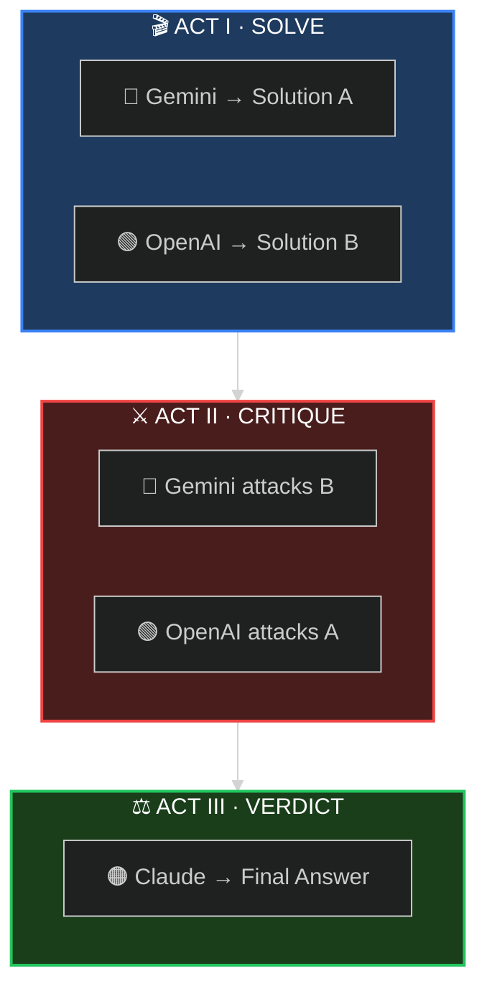

<div align="center">

<!-- Hero Banner -->


<br/>

<!-- Tagline -->
### *When one AI isn't enough, convene the council.*

<br/>

<!-- Status Badges -->
<p>
<a href="#-60-second-setup"></a>
<a href="https://arxiv.org/abs/2309.13007"></a>
<a href="LICENSE"></a>
<a href="https://github.com/quantsquirrel/claude-synod-debate"></a>
</p>

<!-- Language Toggle -->
**[English](README.md)** · **[한국어](README.ko.md)**

</div>

<br/>

<div align="center">

**😵‍💫 Single LLMs are overconfident** &nbsp;→&nbsp; **⚔️ Make them debate** &nbsp;→&nbsp; **✅ Better decisions**

</div>

<br/>

---

<div align="center">

## 🎭 THE THREE ACTS

*Every deliberation follows the same dramatic structure*

</div>

<br/>



<div align="center">

| Act | What Happens | Why It Matters |
|:---:|:-------------|:---------------|
| **I** | Independent solutions emerge | No groupthink — maximum diversity |
| **II** | Cross-examination begins | Weaknesses exposed — biases challenged |
| **III** | Adversarial refinement | Best ideas survive scrutiny |

</div>

<br/>

---

<div align="center">

## ⚡ 60-SECOND SETUP

</div>

```bash
# 1️⃣ Clone the repo
git clone https://github.com/quantsquirrel/claude-synod-debate.git
cd claude-synod-debate

# 2️⃣ Provider API keys
export GEMINI_API_KEY="your-gemini-key"
export OPENAI_API_KEY="your-openai-key"

# 3️⃣ Run setup (installs deps, configures CLI tools, tests models)
/synod-setup

# 4️⃣ Summon the council
/synod review Is this authentication flow secure?
```

<div align="center">

**That's it.** The council convenes automatically.

<br/>


</div>

<br/>

---

<div align="center">

## 🔧 INITIAL SETUP TEST

*Verify your models work before deliberating*

</div>

<br/>

```bash
/synod-setup
```

<div align="center">

| Check | What It Does |
|:-----:|:-------------|
| **CLI** | Verifies all 7 provider CLIs exist |
| **API Keys** | Checks all provider API keys |
| **Response Time** | Tests each model with 120s timeout |
| **Classification** | Labels models: ✓ Recommended / ✓ Usable / ⚠ Slow / ✗ Failed |

</div>

<br/>

<details>
<summary><b>📋 Sample Output</b></summary>

<br/>

```
[Synod Setup] 초기 설정을 시작합니다...

Step 0/3: Python 의존성 확인
  ✓ google-genai 설치됨
  ✓ openai 설치됨
  ✓ httpx 설치됨

Step 1/3: CLI 도구 설치 (~/.synod/bin)
  ✓ gemini-3 설치됨
  ✓ openai-cli 설치됨
  ✓ agy-cli 설치됨 (retired bridge)
  ✓ cliproxy-cli 설치됨 (retired bridge)

Step 2/3: API 키 확인
  ✓ GEMINI_API_KEY (설정됨)
  ✓ OPENAI_API_KEY (설정됨)

Step 3/3: 모델 응답 시간 측정 (타임아웃: 120초)

Provider    Model              Latency    Status
───────────────────────────────────────────────
gemini      pro-latest         3.3초      ✓ 권장
openai      gpt56sol           2.5초      ✓ 권장

[완료] 2/2 모델 사용 가능
Synod를 사용할 준비가 되었습니다!
```

</details>

<br/>

---

<div align="center">

## 🤖 SUPPORTED PROVIDERS

*v3.0: Now supporting 7 AI providers*

</div>

<br/>

<div align="center">

| Provider | CLI | Best For | Status |
|:--------:|:---:|:---------|:------:|
| 🔵 **Gemini** | `gemini-3` | Gemini 3.1 Pro via `GEMINI_API_KEY` | Required |
| 🟢 **OpenAI** | `openai-cli` | gpt-5.6-sol via `OPENAI_API_KEY` | Required |
| ⚪ Retired bridges | `agy-cli` / `cliproxy-cli` | Antigravity / CLIProxyAPI (expired 2026-06-30) | Recovery only |
| 🟣 **DeepSeek** | `deepseek-cli` | Math, reasoning (R1) | Optional |
| ⚡ **Groq** | `groq-cli` | Ultra-fast inference (LPU) | Optional |
| 🌐 **OpenRouter** | `openrouter-cli` | Multi-model fallback | Recommended |
| 🔶 **Grok** | `grok-cli` | 2M context window | Opt-in |
| 🟠 **Mistral** | `mistral-cli` | Code, European deployment | Opt-in |

</div>

<br/>

<details>
<summary><b>🔑 Extended Provider Setup</b></summary>

<br/>

```bash
# Optional: Add more providers to your council
export DEEPSEEK_API_KEY="your-deepseek-key"   # DeepSeek R1
export GROQ_API_KEY="your-groq-key"           # Groq LPU
export OPENROUTER_API_KEY="your-openrouter-key" # OpenRouter (Recommended)

# Opt-in Providers (requires explicit activation)
# Grok (2M context window)
export SYNOD_ENABLE_GROK=1
export XAI_API_KEY="your-xai-key"

# Mistral (code specialization)
export SYNOD_ENABLE_MISTRAL=1
export MISTRAL_API_KEY="your-mistral-key"
```

</details>

<br/>

---

<div align="center">

## 🎯 FIVE MODES OF DELIBERATION

*Choose your council configuration*

</div>

<br/>

<div align="center">

| | Mode | Summon When... | Configuration |
|:---:|:---:|:---------------|:--------------|
| 🔍 | **`review`** | Analyzing code, security, PRs | `Gemini 3.1 Pro` ⚔️ `gpt-5.6-sol` |
| 🏗️ | **`design`** | Architecting systems | `Gemini 3.1 Pro` ⚔️ `gpt-5.6-sol` |
| 🐛 | **`debug`** | Hunting elusive bugs | `Gemini 3.1 Pro` ⚔️ `gpt-5.6-sol` |
| 💡 | **`idea`** | Brainstorming solutions | `Gemini 3.1 Pro` ⚔️ `gpt-5.6-sol` |
| 🌐 | **`general`** | Everything else | `Gemini 3.1 Pro` ⚔️ `gpt-5.6-sol` |

</div>

<br/>

<details>
<summary><b>📝 Example Commands</b></summary>

<br/>

```bash
# Code review
/synod review "Is this recursive function O(n) or O(n²)?"

# System design
/synod design "Design a rate limiter for 10M requests/day"

# Debugging
/synod debug "Why does this only fail on Tuesdays?"

# Brainstorming
/synod idea "How do we reduce checkout abandonment?"
```

</details>

<br/>

---

<div align="center">

## 📜 RESEARCH PROVENANCE

*Where each mechanism's design was borrowed from — cited numbers are the papers' results on their benchmarks, **not** measured Synod performance (Synod's own benchmark harness lives in `benchmark/`)*

</div>

<br/>

<div align="center">

| Protocol | Source | What Synod Borrows |
|:--------:|:-------|:----------------------|
| **ReConcile** | [ACL 2024](https://arxiv.org/abs/2309.13007) | Multi-round convergence structure (the paper reports >95% of its quality gains within 3 rounds — its result, not ours) |
| **AgentsCourt** | [arXiv 2024](https://arxiv.org/abs/2408.08089) | Judge/Defense/Prosecutor structure |
| **ConfMAD** | [arXiv 2025](https://arxiv.org/abs/2502.06233) | Confidence-aware soft defer |
| **DOWN** | [arXiv 2025](https://arxiv.org/abs/2504.05047) | Skip-debate-on-consensus gate (Phase 1.5, default-on since v3.8) |
| **CortexDebate** | see Trust Equation below | CRIS trust formula |

In-house heuristics (no external citation): SID self-signal XML contract,
anti-conformity prompt instructions. v3.8 demoted self-reported confidence
from control signal to display/floor-only, following
[When Two LLMs Debate (arXiv:2505.19184)](https://arxiv.org/abs/2505.19184).

</div>

<br/>

### 🔬 Research-Driven Changes (v3.8–v3.9)

In 2026-07 we audited Synod against the 2024–2026 multi-agent deliberation
literature (~60 sources across four sweeps: does debate work, protocol design,
failure modes, industry practice). Every proposed change was adversarially
verified against the actual codebase before implementation. This section
records **what changed, on what evidence, and how strong that evidence is** —
so future tuning argues with the citations, not with vibes.

#### What the literature supports — and Synod keeps

| Design choice | Supporting evidence |
|:--|:--|
| **Heterogeneous cross-provider panel** | The single best-supported choice. The ICLR 2025 systematic MAD evaluation found heterogeneous panels the *only* consistently positive configuration (88.2% vs 84.2% single-model); [Stop Overvaluing MAD (arXiv:2502.08788)](https://arxiv.org/abs/2502.08788) calls heterogeneity the "universal antidote"; one different-family peer cuts harmful answer revisions from 89% to 35% (2026). Same-family models share correlated errors — cross-provider panels decorrelate them. |
| **Orchestrator mines the transcript; no majority voting** | Voting discards correct answers that are present in the transcript — a 32.3pp "oracle gap" (Cost of Consensus, 2025). Claude-as-synthesizer reads everything instead of counting votes. |
| **Independent Phase 1, no cross-contamination** | Answer diversity must be seeded before any exposure ([Voting or Consensus? arXiv:2502.19130](https://arxiv.org/abs/2502.19130): independent-first + few rounds). |
| **Few rounds, adaptive skip** | The literature plateau is 2–4 agents and ~2 rounds; extra rounds measurably *hurt* via sycophantic flips ([Talk Isn't Always Cheap, arXiv:2509.05396](https://arxiv.org/abs/2509.05396)). Synod's fixed 2-cross-exposure-round structure sits at the plateau; the debate gate skips even those when solvers already agree ([DOWN, arXiv:2504.05047](https://arxiv.org/abs/2504.05047): ~60% of queries skippable at equal-or-better accuracy). |

#### What the literature contradicted — and Synod changed

| Change (version) | What was wrong | Evidence | Strength |
|:--|:--|:--|:--|
| **Debate gate default-on, keyed on claim agreement; deep/ultra always debates** (v3.8) | Skipping was opt-in, and 50% of the old composite score was self-reported signals | Debate adds no expected correctness over independent answers + aggregation on easy consensus cases (martingale result, [Debate or Vote, arXiv:2508.17536](https://arxiv.org/abs/2508.17536)); debate pays only on hard contested problems ([Revisiting MAD as Test-Time Scaling, arXiv:2505.22960](https://arxiv.org/abs/2505.22960)) | multi-source |
| **Self-reported confidence demoted to display + fail-closed floor** (v3.8) | Four decisions (early exit, gate, weighting, defer) keyed on verbal self-confidence | In 61.7% of debates *both* sides claim ≥75% win probability, and confidence rises with rounds regardless of merit ([When Two LLMs Debate, arXiv:2505.19184](https://arxiv.org/abs/2505.19184)) | replicated |
| **`FINAL_CONFIDENCE = Σ(T·C)/Σ(T)` deleted → mechanical 합의 지표** (v3.8) | The formula laundered uncalibrated self-reports through unvalidated CRIS weights into one authoritative-looking % | Same confidence literature + the oracle-gap result favoring transcript evidence over scalar aggregates | multi-source |
| **Anonymization default-on** (v3.8) | Provider identities were visible to external models by default | Identity cues drive sycophantic premature consensus ([arXiv:2510.07517](https://arxiv.org/abs/2510.07517)); self-preference is driven by self-recognition ([Panickssery et al., arXiv:2404.13076](https://arxiv.org/abs/2404.13076)). Honest caveat: the in-session Claude judge builds the alias map itself and **cannot be blinded** — the benefit is for the stateless external CLIs | multi-source |
| **Authorship-aware court roles; rubric-decomposed judge with anti-style instruction** (v3.8) | Hardcoded Gemini=Defense/OpenAI=Prosecutor could make a provider prosecute its own winning solution; single holistic rulings reward rhetoric | Judge order/style biases flip rankings ([LLMs are not Fair Evaluators, arXiv:2305.17926](https://arxiv.org/abs/2305.17926)); style bias now exceeds position bias, and rubric decomposition cuts self-preference ~31.5% ([Judging the Judges, arXiv:2604.23178](https://arxiv.org/abs/2604.23178)) | mixed: biases replicated; the 31.5% figure is a single 2026 preprint |
| **Dynamic rounds machinery deleted** (v3.8) | `TOTAL_ROUNDS` was a session label that never changed execution — a placebo knob | Protocol knobs are second-order versus participant strength/diversity ([arXiv:2511.07784](https://arxiv.org/abs/2511.07784)); width beats depth on the compute Pareto frontier ([arXiv:2605.01566](https://arxiv.org/abs/2605.01566)) | multi-source for the plateau; the deletion itself is a repo fact |
| **Citation verifier: file-exists + line-in-range, per model** (v3.9) | The evidence gate *counted* citation-shaped strings — fabricated `utils.py:9999` scored as evidence | Grounded debate beats ungrounded (+5.5%, [Tool-MAD, arXiv:2601.04742](https://arxiv.org/abs/2601.04742)); 21% of multi-agent failures trace to weak verification ([MAST, arXiv:2503.13657](https://arxiv.org/abs/2503.13657)) | single-paper 2026 preprints, but convergent direction; the counting flaw was locally verified |
| **Lossless claim ledger replaces ≤30-word summaries; mandatory Dissent section** (v3.9) | Phase 2 compressed each solver to one sentence — the exact factual-attrition mechanism the literature measures; evidenced minority views could vanish silently | Up to 72% of issue-critical facts erased across rounds while stances homogenize ([The Deliberative Illusion, arXiv:2606.03032](https://arxiv.org/abs/2606.03032)); 76–89% problem drift on subjective/design tasks ([Stay Focused, arXiv:2502.19559](https://arxiv.org/abs/2502.19559)); in ~25% of divergent cases the minority is right and judge-driven majority overrides test net-negative ([Minority Sentinel, arXiv:2606.29270](https://arxiv.org/abs/2606.29270)) | single-paper 2026 preprints, mutually corroborating |
| **Execution arbiter for debug/review** (v3.9; **default-on since v3.12**) | Code disputes were settled by rhetoric even when the target repo had a runnable test suite. Through v3.11 it stayed behind `SYNOD_EXEC_ARBITER=1`, so the default path still settled code questions by argument | Execution-grounded candidate selection is how SWE-bench SOTA picks answers ([CWM, arXiv:2510.02387](https://arxiv.org/abs/2510.02387)); models should debate only what execution cannot settle. The gate already required debug/review mode + a `TARGET_PATH` + a probe that collected ≥1 test — conditions that select exactly the cases where execution *can* settle something — so the extra opt-in flag suppressed a signal the pipeline had already qualified | product/benchmark-backed pattern; bounded (pytest `-x`, hard timeout, timeout = UNSETTLED). Honest caveat: it runs the target's own suite with no baseline, so a **pre-existing** failing test is reported as machine-verified evidence — set `SYNOD_EXEC_ARBITER=0` for red or side-effecting suites |
| **CRIS rubric demoted to mechanical trust** (v3.10) | Trust was Claude self-grading itself and rivals on unmeasurable qualities (C/R/I/S bands) | LLM-judge trust overrides tested net-negative ([Minority Sentinel, arXiv:2606.29270](https://arxiv.org/abs/2606.29270)); verification, not judgment, is where reliability comes from ([MAST, arXiv:2503.13657](https://arxiv.org/abs/2503.13657)). With TARGET_PATH: `T = 0.25 + 1.75 × verified-citation-rate` (all-fabricated → excluded at 0.25; all-verified → 2.0 cap; nothing decidable → neutral 1.0). Without: uniform 1.0 — no self-graded substitute. trust-scores.json schema unchanged with a `basis` field | the counter-indication is single-paper; the replacement signal is auditable ground truth |
| **Judgment-task arm added; GSM8K arm demoted to a cost measurement** (unreleased) | Synod's only self-measurement was an S0-vs-S3 ablation on GSM8K — and its live path silently ran 10 single-step problems instead of the documented 50, so it could not have separated the arms even once fixed | The negative results on debate concentrate on *verifiable* tasks ([Debate or Vote, arXiv:2508.17536](https://arxiv.org/abs/2508.17536); Smit et al. ICML 2024), while the predicted gains are on tasks with no checkable answer — so the discriminating arm must be open-ended. `benchmark/judgment_eval.py` runs 50 authored design/review tasks × 4 rubric criteria through an anonymised, position-swapped, rubric-decomposed cross-family judge ([arXiv:2305.17926](https://arxiv.org/abs/2305.17926), [arXiv:2404.13076](https://arxiv.org/abs/2404.13076), [arXiv:2604.23178](https://arxiv.org/abs/2604.23178)), and **refuses to name a winner** above a 30% position-flip rate | the debiasing measures are literature-backed; the task set is authored by this repo and has no external validation, and no live run has been paid for yet — the harness is honest about both |
| **S0 killer-baseline harness + live runner** (v3.10) | Synod had never run the one ablation that tests its core value claim; LiveRunner was a `NotImplementedError` stub targeting retired CLIs | Most of MAD's measured gains are explained by independent answers + aggregation ([Smit et al., ICML 2024](https://arxiv.org/abs/2311.17371); martingale result [arXiv:2508.17536](https://arxiv.org/abs/2508.17536)) — S0 (independent + one synthesis pass, zero cross-talk) is now a first-class arm alongside S1/S2/S3, and LiveRunner targets the current direct-API lanes | harness shipped and mock-validated; **live numbers still pending** — mock S3 remains scripted-correct by construction, mock S0 synthesis is an honest majority vote |

#### What we deliberately did NOT change

- **Step 2.1b soft defer** (low-confidence hint) — kept: it *protects* minority
  perspectives against premature consensus, which is an anti-sycophancy use of
  the confidence signal, not a decision gate.
- **CRIS `--trust` parser CLI** — the C/R/I/S formula (cited to CortexDebate)
  remains available as a tested utility, but as of v3.10 it is no longer part
  of the default flow: trust comes from verified-citation rate (TARGET_PATH
  set) or uniform neutral weighting (otherwise). It was retained rather than
  deleted so existing tests and any external callers keep working.
- **Anti-conformity prompt instructions in Phase 3** — retained but no longer
  load-bearing: [Talk Isn't Always Cheap](https://arxiv.org/abs/2509.05396)
  shows prompt-level anti-sycophancy fails to stop flips, which is exactly why
  v3.8+ mitigations are *mechanical* (gate, ledger, verifier, arbiter) rather
  than more prompt text.

#### Honest limitations

1. **No local benchmark evidence yet.** Every number above is from the papers'
   benchmarks, not from Synod runs — `benchmark/results/` is still empty.
   As of v3.10 the missing piece is no longer tooling: the S0 arm and a real
   LiveRunner exist and are mock-validated. What remains is the live run
   itself (`SYNOD_BENCH_LIVE=1 … --live`), which bills three provider APIs
   and has deliberately not been run without explicit owner consent. Until
   then, mock numbers validate the harness only (S3 is scripted-correct by
   construction).
2. **2026 preprints are marked as such.** Tool-MAD, Deliberative Illusion,
   Minority Sentinel, Judging the Judges, and the width-vs-depth Pareto result
   are single-paper, often small-model validations. They all point the same
   direction, which is why we acted on them — but they are directional, not
   settled.
3. **The top-end question is open.** No study yet cleanly pits a heterogeneous
   frontier panel (GPT-5.x + Gemini 3.x + Claude 4/5-class at full reasoning
   depth) against a single frontier model given the same total budget. The
   matched-compute negatives all used 2025-era or distilled models. Synod's
   existence bet lives in that gap; the S0 ablation is how we intend to
   measure it for our own workload.

<br/>

<br/>

<details>
<summary><b>📊 The Trust Equation</b></summary>

<br/>

Synod calculates trust using the **CortexDebate** formula:

```
                Credibility × Reliability × Intimacy
Trust Score = ────────────────────────────────────────
                      Self-Orientation
```

| Factor | Measures | Range |
|:------:|:---------|:-----:|
| **C** | Evidence quality | 0–1 |
| **R** | Logical consistency | 0–1 |
| **I** | Problem relevance | 0–1 |
| **S** | Bias level (lower = better) | 0.1–1 |

**Interpretation:**
- `T ≥ 1.5` → Primary source (high trust)
- `T ≥ 1.0` → Reliable input
- `T ≥ 0.5` → Consider with caution
- `T < 0.5` → Excluded from synthesis

</details>

<br/>

---

<div align="center">

## 📦 INSTALLATION

</div>

<details>
<summary><b>🚀 Quick Installation (Recommended)</b></summary>

<br/>

```bash
# Clone the repo
git clone https://github.com/quantsquirrel/claude-synod-debate.git
cd claude-synod-debate

# Prerequisites: provider API keys
export GEMINI_API_KEY="your-gemini-key"
export OPENAI_API_KEY="your-openai-key"

# Run setup inside Claude Code (auto-installs Python deps, creates CLI wrappers, tests models)
/synod-setup
```

Skills auto-load from `plugin.json` when you open Claude Code inside this directory. `/synod-setup` handles the rest: Python dependencies (`openai`, `httpx`), CLI tool wrappers in `~/.synod/bin/`, local auth validation, and model connectivity testing.

</details>

<details>
<summary><b>🔧 Manual Installation (without Claude Code)</b></summary>

<br/>

```bash
git clone https://github.com/quantsquirrel/claude-synod-debate.git
cd claude-synod-debate
pip install openai httpx

# Create CLI wrappers and test models
python3 tools/synod-setup.py
```

</details>

<details>
<summary><b>⚙️ Configuration</b></summary>

<br/>

```bash
# Required — the Gemini and OpenAI lanes call the vendor APIs directly
export GEMINI_API_KEY="your-gemini-key"   # GOOGLE_API_KEY also accepted
export OPENAI_API_KEY="your-openai-key"

# Optional
export SYNOD_SESSION_DIR="~/.synod/sessions"
export SYNOD_RETENTION_DAYS=30
```

</details>

<br/>

---

<div align="center">

## 🔒 COMPATIBILITY

</div>

<br/>

<div align="center">

| Environment | Status | Notes |
|:-----------:|:------:|:------|
| **bash** | ✅ | Fully supported |
| **zsh** | ✅ | Fully supported (v3.0.1+) |
| **MCP Plugins** | ✅ | Guard directives prevent routing interception |
| **OMC (oh-my-claudecode)** | ✅ | CODEX-ROUTING opt-out built-in |

</div>

<br/>

<details>
<summary><b>🛡️ MCP Routing Protection</b></summary>

<br/>

Synod executes external models (Gemini, OpenAI) exclusively via **CLI tools** (`gemini-3`, `openai-cli`; retired bridges `agy-cli`/`cliproxy-cli`). If your environment includes MCP routing plugins that redirect model calls through `ask_codex` or `ask_gemini`, Synod's built-in defense-in-depth guards prevent interception:

1. **`allowed-tools` frontmatter** — Schema-level restriction excludes MCP tools
2. **Markdown directives** — Explicit prohibition in skill entry point and Phase 0/1
3. **Automated tests** — CI validates guard presence against configuration drift

No additional configuration needed — protection is automatic.

</details>

<br/>

---

<div align="center">

## 🗺️ ROADMAP

</div>

- [ ] **MCP Server** — Native Claude Code integration
- [ ] **VS Code Extension** — GUI for debate visualization
- [ ] **Knowledge Base** — Learning from debate history
- [ ] **Web Dashboard** — Real-time debate monitoring
- [x] **More LLMs** — ~~Llama, Mistral, Claude variants~~ **v3.0: 7 providers supported!**

<br/>

---

<div align="center">

## 🤝 JOIN THE COUNCIL

**[Issues](https://github.com/quantsquirrel/claude-synod-debate/issues)** · **[Discussions](https://github.com/quantsquirrel/claude-synod-debate/discussions)** · **[Contributing](CONTRIBUTING.md)**

<br/>

<details>
<summary><b>📖 Citation</b></summary>

```bibtex
@software{synod2026,
  title   = {Synod: Multi-Agent Deliberation for Claude Code},
  author  = {quantsquirrel},
  year    = {2026},
  url     = {https://github.com/quantsquirrel/claude-synod-debate}
}
```

</details>

<br/>

**MIT License** · Copyright © 2026 quantsquirrel

*Built on the shoulders of*<br/>
**ReConcile** · **AgentsCourt** · **ConfMAD** · **DOWN** · **CortexDebate**

<br/>

> *"In the multitude of counselors there is safety."* — Proverbs 11:14

</div>
